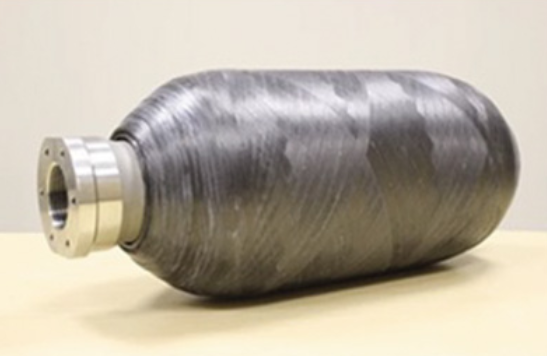
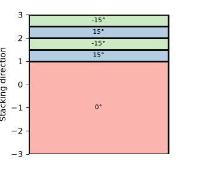
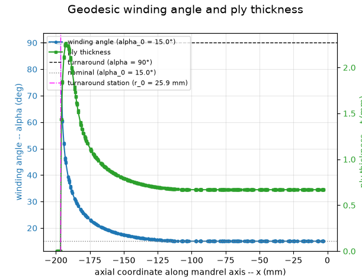
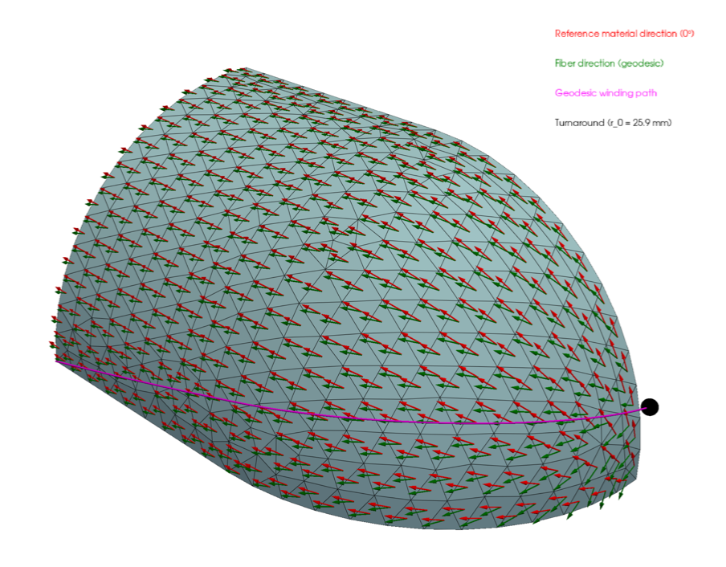
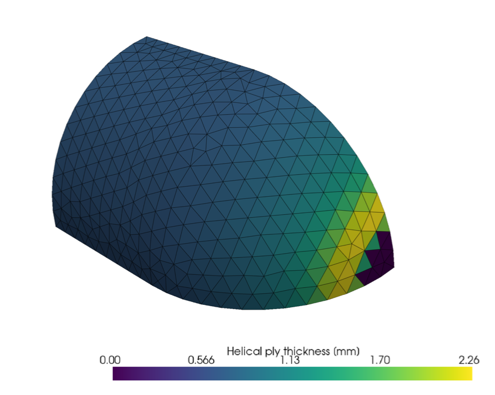
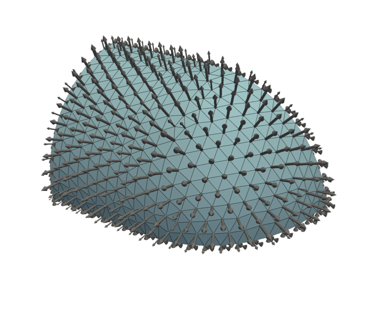
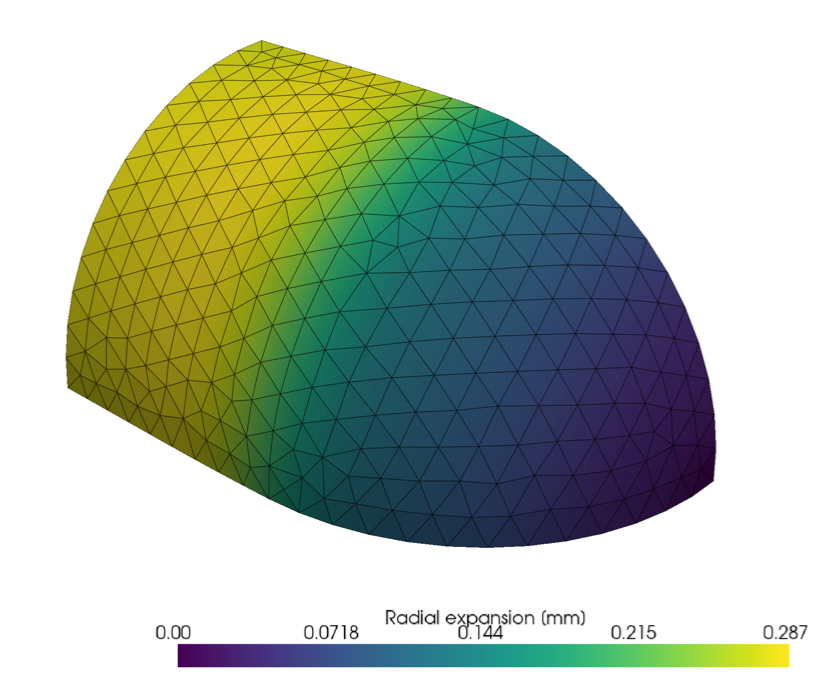

# COPV Filament-Winding FEA

Finite element analysis of a **Composite Overwrapped Pressure Vessel (COPV)** using [Torch FEM](https://github.com/meyer-nils/torch_fem). 
A metallic liner is overwrapped with helical carbon-fiber plies and loaded by internal pressure.

The goal here is to have a realistic and accurate model taking **manufacturing constraints** into account (true fiber firections from manufacturing process, and thickness build-up).



## Manufacturing Winding models

Two manufacturing winding models are available, toggled by `GEODESIC_WINDING`:

| Mode | Description |
|------|-------------|
| `False` | **Nominal** : constant ply angle and uniform thickness over the whole surface |
| `True`  | **Geodesic (Clairaut)** : each ply follows `r·sin(α) = R·sin(α₀)`, so the winding angle opens toward 90° at the turnaround radius and the thickness follows the band build-up over the dome|

## Laminate

An aluminium liner (0°) combined with four symmetric CFRP helical plies (±15°):



## Geodesic winding angle and ply thickness

The Clairaut relation maps each element's meridional radius to a winding angle and a band-coverage thickness. Both are plotted against the mandrel axis below.

A variable thickness distribution (accounting for tapes overlapping in domes) model is also applied (using Wang's cubic spline method, see plot curve in green color).



## Fiber directions on the mesh

Red = reference material direction (0°), green = true fiber direction following the geodesic path. The magenta line marks the turnaround station (r₀ = 25.9 mm).



## Helical ply thickness distribution

The band build-up concentrates near the turnaround, where the fiber density increases before the ply drops off.



## FE Model

An octant of vessel is modeled (triangles shell elements), with proper symmetry boundary conditions.
An internal pressure load case (10 MPa) is applied (outward element normals).



## FEA results

Here are radial expansion displacements results:



## Next

Here are a few potential improvements:
- Use semi-geodesics (friction-controlled) helix winding path, for better control of both winding angle in cylinder and polar boss tangency
- Structural optimization using parametric model


## Dependencies

- [torchfem](https://github.com/meyer-nils/torch_fem)
- PyTorch
- NumPy / SciPy
- PyVista
- Matplotlib

## Usage

```bash
python copv_winding_fea.py
```

Set `GEODESIC_WINDING = True/False` at the top of the script to switch between the manufacturing and nominal model.
